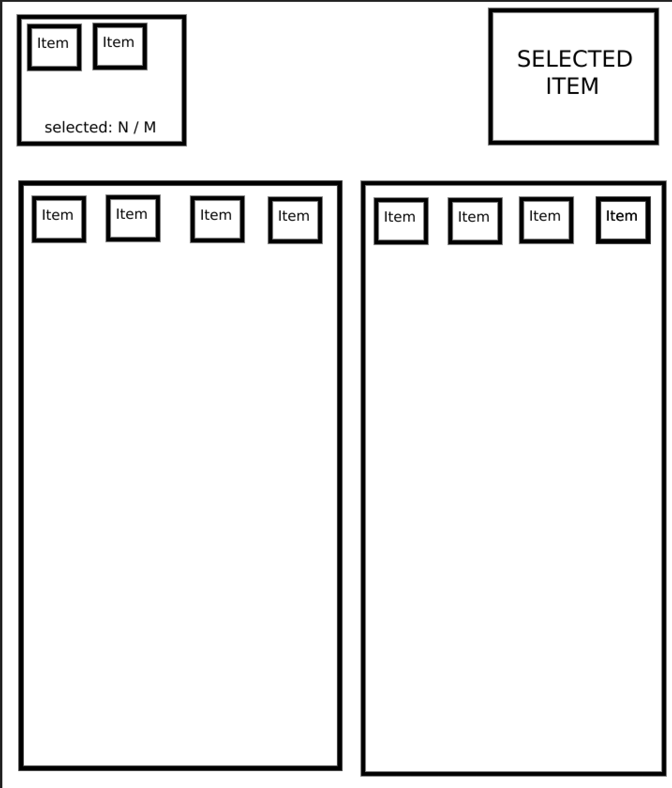

# test-task-frontend

## Test task

Task: Make a working page from an image.



No design is required. A schematic page, as shown in the image, is enough.

1) Blocks from the bottom:

On the left - the user's items  
On the right - things to choose from

2) Blocks on top:

On the left are selected items from the user's belongings (the block on the bottom is on the left)  
On the right is the selected item from the items to choose from (the block from the bottom is on the right).

The objects of things have the same structure, they differ only in name and number.

---

The mechanics of work

From bottom to right, you can select "only 1 thing" at a time, which should be displayed from top to right.
From the bottom to the left, you can select "from 1 to 6 things" that should be displayed in the upper-left part in the order of selection.

---

Collections to fill in the lower blocks on the left and right:

1) The block on the left:

```
[
    {
        "id": 1,
        "name": "Shoes 1"
    },
    {
        "id": 2,
        "name": "Shoes 2"
    },
    {
        "id": 3,
        "name": "Shoes 3"
    },
    {
        "id": 4,
        "name": "Shoes 4"
    },
    {
        "id": 5,
        "name": "T-shirt 1"
    },
    {
        "id": 6,
        "name": "T-shirt 2"
    },
    {
        "id": 7,
        "name": "T-shirt 3"
    },
    {
        "id": 8,
        "name": "T-shirt 4"
    }
]
```

2) The block on the right

```
[
    {
        "id": 11,
        "name": "Jacket 1"
    },
    {
        "id": 12,
        "name": "Jacket 2"
    },
    {
        "id": 13,
        "name": "Jacket 3"
    },
    {
        "id": 14,
        "name": "Jacket 4"
    },
    {
        "id": 15,
        "name": "Hoodie 1"
    },
    {
        "id": 16,
        "name": "Hoodie 2"
    },
    {
        "id": 17,
        "name": "Hoodie 3"
    },
    {
        "id": 18,
        "name": "Hoodie 4"
    }
]
```

## Project Setup

```sh
npm install
```

### Compile and Hot-Reload for Development

```sh
npm run dev
```

### Type-Check, Compile and Minify for Production

```sh
npm run build
```
